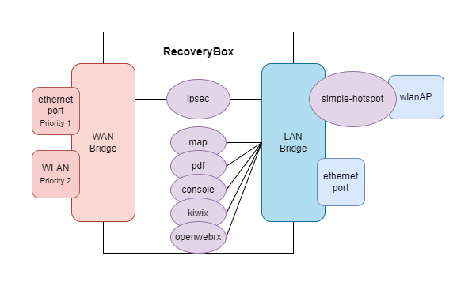

# Network Configuration

## Overview

RecoveryBox uses a **network bridge** architecture to manage its interconnections in a versatile way. Each physical interface can be assigned to one of the bridges depending on needs.

Interface management is handled by **[systemd-networkd](https://wiki.debian.org/SystemdNetworkd)**.

## Diagram

## Architecture

### Bridges

| Bridge | Role |
| --- | --- |
| **Wan** | Groups interfaces connected to the Internet (Ethernet in priority, Wi-Fi as fallback) |
| **Lan** | Groups local network interfaces (clients, internal services) |

### Wi-Fi interface (wlanAP)

The `wlanAP` interface is linked to the **[simple-hotspot](https://github.com/mr-dgidgi/Simple-Hotspot)** container, which bridges it to the **Lan** interface.

### WAN priority

**Priority** is always given to **Ethernet interfaces**. Even if a Wi-Fi interface on the WAN obtains a route with a gateway, the Ethernet interface takes priority as long as it is active.

## iptables Rules

iptables rules are defined in the file `/etc/iptables/iptables.sh`.

### Default rules

| Chain | Rule | Description |
| --- | --- | --- |
| **INPUT** | All from Lan | Traffic allowed from the local network |
| **INPUT** | ICMP from Wan | Ping allowed from the Internet |
| **INPUT** | SSH (port 22) from Wan | SSH connection allowed from the Internet |
| **INPUT** | Drop from Wan | All other inbound WAN traffic blocked |
| **FORWARD** | All to Wan | Traffic forwarded to the Internet |
| **FORWARD** | All to containers | Traffic forwarded to Docker containers |
| **NAT** | Masquerade on Wan exit | Address translation for Internet access |

## Interface management

!!! warning "Managed files"
    All interface and rule management is performed by the **network-configurator** script. All files managed by this script are prefixed with the comment `Managed by network-configurator`. Manual modifications to these files may be overwritten when running **network-configurator**.
